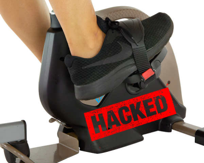
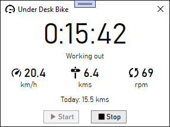

# Hacking a $200 Under Desk Exercise Bike



Due to COVID, I haven't been getting my usual amount of exercise this year.  To help with that, I decided to take a chance and order an under desk exercise bike to get some more cardio.  The bike I bought is decent: good tension, doesn't move around, is very quiet, and has Bluetooth connectivity for tracking workouts.  

If you're thinking of getting one of these under desk bikes I wouldn't automatically recommend it.  If your desk is normal sized you will bump your knees on it.  But my desk is designed to be used with a keyboard tray and I hate keyboard trays.  So instead my keyboard is on the top of the desk, my chair is raised up, and I use a footrest.  All this means that my desk is actually the perfect height for peddling.

Bluetooth connectivity is important to me; being able to see and record speed and distance is a big motivator.  For connectivity there is unsurprisingly a phone app.  It's not a good app.  It feels unpolished and gets mediocre reviews.  And, of course, it also requires a signup and tries to upsell you on a subscription for classes.  I can ignore all that.  But, sitting at my workstation, I don't want to take out my phone and go through 5 steps every time I want to workout.  Nor do I want to keep my phone on and propped up on my desk for long periods of time.  Lastly, I very much did not want all my workout data locked away in this app.

The solution was obvious -- build my own desktop app!

## The Project

I was inspired by this article: [Unbricking a $2,000 Bike With a $10 Raspberry Pi](https://ptx2.net/posts/unbricking-a-bike-with-a-raspberry-pi/).  I figured my under desk bike probably worked in a similar way and if I could connect to it from my desktop I could write my own application.

#### Objectives

* Display, in real time, the workout data in a small window on the desktop.
* Record the workout data to a SQLite database for analysis, goal setting, and motivation.
* If possible, have the app start and stop automatically whenever I start peddling.

#### Complications

* My desktop didn't have Bluetooth
* Zero experience working with Bluetooth LE

I solved the first complication by getting a USB dongle off of Amazon.  The second complication would be solved as I went.

## Step 1 - Research

The first task was to google for as much information as possible.  This lead to a piece of software called [nRF Connect](https://play.google.com/store/apps/details?id=no.nordicsemi.android.mcp).  This Android software shows information about all your Bluetooth devices, allows you connect to them, show you all the available profiles, and log data.  With this I learned the bike uses a chip called [Nordic UART](https://developer.nordicsemi.com/nRF_Connect_SDK/doc/latest/nrf/include/bluetooth/services/nus.html).  This is basically a serial connection at one end and Bluetooth on the other.  This was great news - it should mean that the bike is just streaming bytes.  

However, connecting to it with nRF connect didn't immediately provide me with any data from the bike.  It was connected, I was subscribed to changes, but no data was being sent.  This would require more work.

So the next step was to run the app and log all the Bluetooth traffic to see what was happening.  More googling sent me to [this article](https://medium.com/@charlie.d.anderson/how-to-get-the-bluetooth-host-controller-interface-logs-from-a-modern-android-phone-d23bde00b9fa) that describes enabling the Bluetooth log on my phone and downloading it for analysis.  I enabled screen recording on my phone, enabled Bluetooth logging, did a couple of runs on the bike, and then downloaded the logs.  

Using Wireshark and comparing it with my recorded video I got see how the app communicated with the bike.  The app would send a command packet and the bike would respond with one or more packets.  The app would send a single command continuously when the workout started and the bike would respond with packets of similar looking data.

## Step 2 - Connecting to the Bike

Using the logs and Wireshark, I determined that the app sends 6 different commands.  So the next step was to create a simple console application that could connect to bike, send the commands, and receive the results.  I needed to see if I could, at minimum, replicate the activity of the app using my own software on the desktop.

The platform of choice for this adventure was .NET 5.0 on Windows.  I needed access to the Windows Runtime for the Bluetooth API in Windows.  I discovered that [this is extremely easy to do](https://docs.microsoft.com/en-us/windows/apps/desktop/modernize/desktop-to-uwp-enhance).  

## Step 3 - Interpreting the Data

The first command the app sends I will call the `Connect` command.  This command must be sent before any other commands.  As soon as you send this command, you must send commands at a minimum of one second intervals or the bike will close the connection.

```none
Start Command:  f9 d0 00 c9
Response:       f9 e0 00 d9
```

The second command the app sends I call the `Hold` command.  Since you must send commands at regular intervals once you've connected, sending this command appears to just keep the connection open.  The bike responds with 2 packets of identical data every time this command is sent.

```none
Hold Command:   f9 d1 05 02 00 00 00 00 d1 
Response #1:    f9 e1 10 07 00 00 00 00 00 00 02 00 03 37 00 00 2a
Response #2:    f9 e2 10 00 00 00 00 00 00 00 00 00 00 00 00 00 00 00 00 eb
```

The 3rd and 4th commands I just call `Info1` and `Info2`.  These commands are sent by the app once per connection and they always return the same information.  This could be model or calibration information.

```none
Info1 Command:  f9 d3 0d 01 00 00 2c 00 00 3c 00 a0 00 00 00 00 e2 00 00 00
Response #1:    f9 e3 01 00 dd
Response #2:    f9 e3 0c 00 00 00 00 00 00 00 00 00 00 00 00 e8

Info2 Command:  f9 d4 0f 02 00 00 00 00 00 00 00 00 00 00 00 00 1f 0f 0c 00
Response:       f9 e4 02 00 00 df
```

At this point we can see the pattern emerge.  Every command and every response starts with the byte `F9`.  The next byte contains the command or response type; the high nibble is `D` for commands and `E` for responses.  The next byte is the length of the packet not including this header.  The next byte after that appears to be some kind of checksum.  

The most interesting commands come next.  I call these the `Start Workout` and `Continue Workout` commands.  The first command is sent when you start the workout and then app continuously sends the second command to sample data from the bike.

```none
Start Cmd:      f9 d5 0d 01 00 00 00 00 00 00 00 00 00 00 00 00 dc 00 00 00
Response #1:    f9 e5 10 00 00 00 00 00 00 00 00 00 00 00 00 00 00 00 01 ef
Response #2:    f9 e6 10 00 00 00 00 00 00 00 00 00 00 00 00 00 00 00 00 ef
Response #3:    f9 e7 10 00 00 00 00 00 00 00 00 00 00 00 00 00 00 00 00 f0
    
Continue Cmd:   f9 d5 0d 00 00 00 00 00 00 00 00 00 00 00 00 00 db 00 00 00
Response #1:    f9 e5 10 00 09 00 03 00 07 00 00 00 99 00 00 53 00 00 01 ee
Response #2:    f9 e6 10 00 00 00 00 00 06 00 00 00 00 00 00 00 00 00 2f 24
Response #3:    f9 e7 10 00 00 00 00 00 00 00 00 00 00 00 00 00 00 00 00 f0
```

At this point I could start assembling and interpreting the data.  The first thing I did was combine all the workout result packets together and lop off the header.  Then I biked for 10 minutes collecting the data.

```none
00 00 00 00 00 00 00 00 00 00 00 00 00 00 01 EF 00 00 00 00 00 00 00 00 00 00 00 00 00 00 00 EF 00 00 00 00 00 00 00 00 00 00 00 00 00 F0 
01 00 00 00 00 00 00 00 00 00 00 00 00 00 01 F0 00 00 00 00 00 00 00 00 00 00 00 00 00 00 00 EF 00 00 00 00 00 00 00 00 00 00 00 00 00 F0 
02 00 00 00 00 00 00 00 00 00 00 00 00 00 01 F1 00 00 00 00 00 00 00 00 00 00 00 00 00 00 00 EF 00 00 00 00 00 00 00 00 00 00 00 00 00 F0 
03 00 00 00 01 00 00 00 BC 00 00 66 00 00 01 15 00 00 00 00 07 00 00 00 00 00 00 00 00 00 19 0F 00 00 00 00 00 00 00 00 00 00 00 00 00 F0 
03 00 01 00 01 00 00 00 BB 00 00 65 00 00 01 14 00 00 00 00 07 00 00 00 00 00 00 00 00 00 19 0F 00 00 00 00 00 00 00 00 00 00 00 00 00 F0 
04 00 01 00 02 00 00 00 BE 00 00 67 00 00 01 1B 00 00 00 00 07 00 00 00 00 00 00 00 00 00 25 1B 00 00 00 00 00 00 00 00 00 00 00 00 00 F0 
05 00 01 00 03 00 00 00 C1 00 00 69 00 00 01 22 00 00 00 00 07 00 00 00 00 00 00 00 00 00 2D 23 00 00 00 00 00 00 00 00 00 00 00 00 00 F0 
06 00 02 00 04 00 00 00 C3 00 00 6A 00 00 01 28 00 00 00 00 07 00 00 00 00 00 00 00 00 00 32 28 00 00 00 00 00 00 00 00 00 00 00 00 00 F0 
07 00 02 00 06 00 00 00 C1 00 00 69 00 00 01 28 00 00 00 00 07 00 00 00 00 00 00 00 00 00 36 2C 00 00 00 00 00 00 00 00 00 00 00 00 00 F0 
07 00 03 00 06 00 00 00 C1 00 00 69 00 00 01 29 00 00 00 00 07 00 00 00 00 00 00 00 00 00 36 2C 00 00 00 00 00 00 00 00 00 00 00 00 00 F0 
08 00 03 00 07 00 00 00 BE 00 00 67 00 00 01 26 00 00 00 00 07 00 00 00 00 00 00 00 00 00 39 2F 00 00 00 00 00 00 00 00 00 00 00 00 00 F0 
09 00 03 00 08 00 00 00 BA 00 00 65 00 00 01 22 00 00 00 00 07 00 00 00 00 00 00 00 00 00 3B 31 00 00 00 00 00 00 00 00 00 00 00 00 00 F0 
0A 00 04 00 09 00 00 00 B0 00 00 5F 00 00 01 15 00 00 00 00 07 00 00 00 00 00 00 00 00 00 3C 32 00 00 00 00 00 00 00 00 00 00 00 00 00 F0 
0B 00 04 00 0A 00 00 00 B5 00 00 63 00 00 01 20 00 00 00 00 07 00 00 00 00 00 00 00 00 00 3D 33 00 00 00 00 00 00 00 00 00 00 00 00 00 F0 
0B 00 05 00 0A 00 00 00 B8 00 00 64 00 00 01 25 00 00 00 00 07 00 00 00 00 00 00 00 00 00 3D 33 00 00 00 00 00 00 00 00 00 00 00 00 00 F0 
0C 00 05 00 0C 00 00 00 BB 00 00 66 00 00 01 2D 00 00 00 00 07 00 00 00 00 00 00 00 00 00 3E 34 00 00 00 00 00 00 00 00 00 00 00 00 00 F0 
0D 00 06 00 0D 00 00 00 BF 00 00 68 00 00 01 36 00 00 00 00 07 00 00 00 00 00 00 00 00 00 3F 35 00 00 00 00 00 00 00 00 00 00 00 00 00 F0 
0E 00 06 00 0E 00 00 00 BF 00 00 68 00 00 01 38 00 00 00 00 07 00 00 00 00 00 00 00 00 00 40 36 00 00 00 00 00 00 00 00 00 00 00 00 00 F0 
0F 00 06 00 0F 00 00 00 BF 00 00 68 00 00 01 3A 00 00 00 00 07 00 00 00 00 00 00 00 00 00 41 37 00 00 00 00 00 00 00 00 00 00 00 00 00 F0 
0F 00 07 00 0F 00 00 00 BE 00 00 67 00 00 01 39 00 00 00 00 07 00 00 00 00 00 00 00 00 00 41 37 00 00 00 00 00 00 00 00 00 00 00 00 00 F0 
...
```

#### Observations

* Lots of constant zeros and a few constant values that can be ignored.
* Some values are bytes and some values are words.
* Some values increased continuously while others were directly related to how fast I was peddling.  These latter values were also zero when not peddling.

Based on these observations I wrote code the break the data down into 9 different byte and word fields.  I ran my console app again during a workout to collect these values into CSV and then threw it into Excel for analysis.  Most of the values became pretty obvious by looking at them.  The slowest part for me was figuring out the bike sends imperial measurements instead of metric.  The 9 fields in order:

* The current second of workout.  This value goes from 0 to 59 over and over.  If you sample faster than every second this value will stay the same for multiple samples.
* The distance in hundredths of a mile.
* The workout time in seconds.  This starts at zero and continues increasing for as long as I am peddling.  When I stop peddling this value will stay the same.
* Speed in tenths of a mile per hour.
* Rotations per minute.
* Unknown (one byte).  Seems related to workout speed but if not moving it increases by one every second and periodically resets to a value and then keeps counting.  
* A speed value from 0 to 9. 
* 2 other unknown byte values.  Both appears to be an average value related to speed over the whole workout but exactly what it represents I don't know.

With these observations, I decided I only needed 3 commands:  The `Connect` command, the `Start Workout` command, and the `Continue Workout` command.  I also didn't need to understand the commands; I just needed to send those bytes in that order. 

## Step 4 - Putting It All Together

The final step was re-arranging the work I had done into a [consistent API](api/) and then create a WPF application for the user interface.  This part wasn't too hard; this is the perfect type of application for MVVM.  I also used Entity Framework Core to very quickly put together the SQLite storage for workout information.



#### Final App Features:

* Displays workout time, current speed, current distance, and current RPM during the workout.
* At the end of the workout, the values switch to the averages of the workout.
* Automatically detects the Bluetooth activating on the bike (it's turned on by peddling).  This starts the workout and pops up the window.
* Pauses the workout when peddling stops.  The workout time will blink while paused.  After one minute of being paused the workout ends automatically.
* Start and Stop buttons for manually controlling the workout.
* The daily distance is shown for goal setting.
* Clicking the X to close the app minimizes it to the system tray.
* Includes system tray icon with context menu. 
* Window can be set to Always on Top (right click the window for context menu).
* Option to have the application automatically start on login.
* Saves the workout information and all the samples from the bike to a SQLite database.

## Conclusion

The app works great and is everything that I hoped it could be.  Now it's just a matter of seeing how far I can peddle.  

[View this project on Github](https://github.com/codaris/UnderDeskBike)