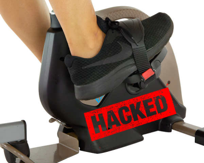
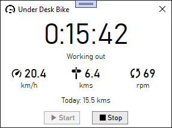

# Under Desk Bike

This project is a Windows desktop application and library for interfacing with an under desk exercise bike.  This is a personal project designed for this exact model of exercise bike.  It might work for other exercise bikes but probably not without some modification.

You can learn more about how this application was developed by [reading this article](https://codaris.github.io/UnderDeskBike/).

## Screen shot

## Features

* Displays workout time, current speed, current distance, and current RPM during the workout.
* At the end of the workout, the values switch to the averages of the workout.
* Automatically detects the Bluetooth activating on the bike (it's turned on by peddling).  This starts the workout and pops up the window.
* Pauses the workout when peddling stops.  The workout time will blink while paused.  After one minute of being paused the workout ends automatically.
* Start and Stop buttons for manually controlling the workout.
* The daily distance is shown for goal setting.
* Clicking the X to close the app minimizes it to the system tray.
* Includes system tray icon with context menu. 
* Window can be set to Always on Top (right click the window for context menu).
* Option to have the application automatically start on login.
* Saves the workout information and all the samples from the bike to a SQLite database.

## API Documentation

View the API documentation for this project by clicking the link below:

* [Under Desk Bike API Documentation](https://codaris.github.io/UnderDeskBike/api/index.html)

## License

This application and library is licensed under the [GNU General Public License v3.0](LICENSE).
